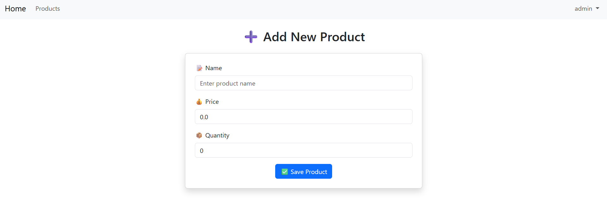
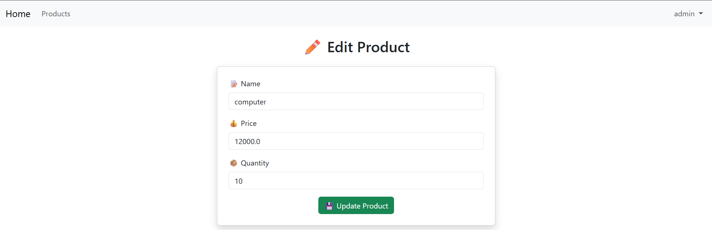

# 🛒 Spring Boot Product Management App

This is a **Spring Boot + Thymeleaf** web application for managing products. It includes full CRUD operations, form validation, search functionality, and secure role-based access using Spring Security.

## 🚀 Features

- 🔐 Login system with `USER` and `ADMIN` roles
- 📦 Product CRUD: add, edit, delete, list
- 🔍 Search products by name
- ✅ Form validation with error messages
- 🌐 Thymeleaf layout with Bootstrap styling
- 🛡️ Spring Security with CSRF protection
- 📄 H2 + MySQL support

## 📸 Screenshots

### 🔑 Login Page


### 📦 Product Listing


### ➕ Add New Product


### ✏️ Edit Product


### 🚫 Access Denied


## 🧰 Tech Stack

- Java 21
- Spring Boot 3.4.5
- Spring Web / Security / Data JPA / Validation
- Thymeleaf with Layout Dialect
- Bootstrap 5 via WebJars
- H2 (runtime) + MySQL (runtime)
- Lombok

## 🛠️ Run Locally

```bash
git clone https://github.com/yourname/spring-product-crud.git
cd spring-product-crud
mvn spring-boot:run
```

Visit: `http://localhost:8094`

## 👤 Default Users

| Username | Password | Role  |
|----------|----------|-------|
| saad     | 1234     | USER  |
| admin    | 1234     | ADMIN |
| user2    | 1234     | USER  |

## 📁 Folder Structure

```
src
├── main
│   ├── java/ma/enset/bdccspringensetmvc
│   │   ├── web          # Spring MVC Controllers
│   │   ├── entities     # JPA Entities
│   │   ├── repository   # JPA Repositories
│   │   └── security     # Spring Security config
│   └── resources/templates
│       ├── layout1.html
│       ├── products.html
│       ├── newProduct.html
│       ├── editProduct.html
│       ├── login.html
│       └── notAuthorized.html
```

## 📜 License

Free for educational use.
